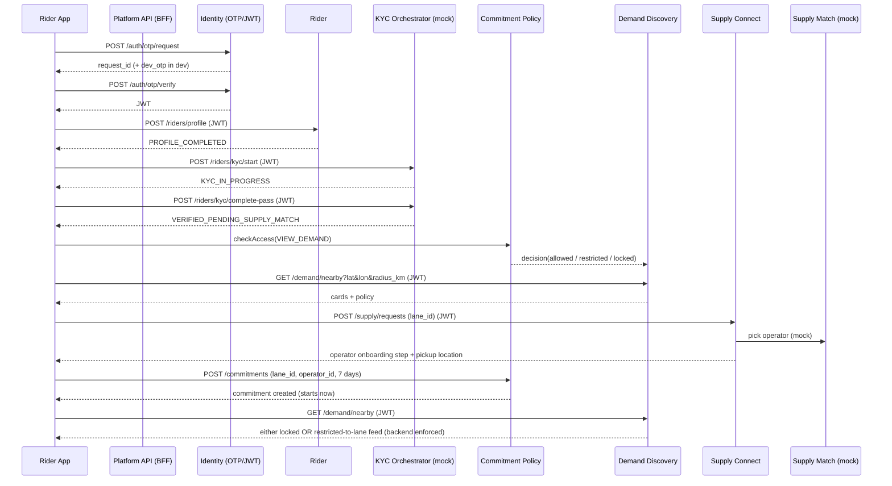

# Rider entry → demand discovery → connect → onboarding → commitment lock (MVP)

This document describes the **end-to-end workflow** implemented in `services/platform-api` and the **bounded contexts** you can later extract into microservices.

## State machine (rider verification)

Statuses live on `riders.status`:

- `NEW`: created after OTP verify
- `PROFILE_COMPLETED`: profile captured
- `KYC_IN_PROGRESS`: started KYC
- `VERIFIED_PENDING_SUPPLY_MATCH`: KYC pass → eligible to connect to supply

Commitment lock is **not** a rider.status; it’s enforced by `commitment_policy` using `commitments` records.

## Sequence (happy path)

## Commitment lock enforcement

Every demand feed call executes:

1. `check_access(rider_id, action="VIEW_DEMAND")`
2. If locked → return `423 LOCKED` with `unlock_at`
3. If restricted → return only the committed `lane_id`

This is a **hard backend gate**, not UI-only.

## Bounded contexts (microservice candidates)

Currently implemented as domain modules inside a single FastAPI app:

- `identity`: OTP challenge + JWT issuance
- `rider`: profile + verification state
- `kyc`: mocked KYC transitions (vendor integration later)
- `demand_discovery`: returns sanitized demand cards (geo + caching later)
- `supply_match`: selects eligible operator candidates (optimizer later)
- `supply`: “connect me” request creation + onboarding handoff payload
- `commitment_policy`: rule enforcement + commitment lifecycle

